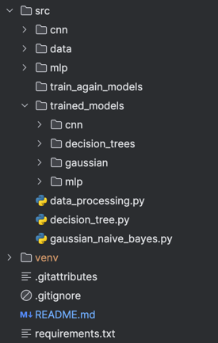

AI Image classification project from:
### Harinder Partap Singh 40076200
### Sanjai RATNARAJAH 27079303 

# Setup to run the project
Note: Python version 3 is recommended and use the command line tool to do the setup and run the project

### Step 1: Clone the repo using following command
- git clone https://github.com/HarryIsCodingg/ImageClassificationAI.git 

  Note: Make sure that all the files are cloned successfully, since it has large files also so it could take around 5-10 minutes. Expected to see following while cloning:
  ```
  Cloning into 'ImageClassificationAI'...
      remote: Enumerating objects: 118, done.
      remote: Counting objects: 100% (118/118), done.
      remote: Compressing objects: 100% (88/88), done.
      remote: Total 118 (delta 46), reused 56 (delta 19), pack-reused 0 (from 0)
      Receiving objects: 100% (118/118), 6.88 MiB | 910.00 KiB/s, done.
      Resolving deltas: 100% (46/46), done.
      Filtering content: 100% (6/6), 4.01 GiB | 5.19 MiB/s, done.
      Encountered 5 files that should have been pointers, but weren't:
      src/trained_models/mlp/default_mlp.pth
      src/trained_models/mlp/mlp_experiment1.pth
      src/trained_models/mlp/mlp_experiment2.pth
      src/trained_models/mlp/mlp_experiment3.pth
      src/trained_models/mlp/mlp_experiment4.pth
  ```
### Step 2: Change directory where the repository is cloned
``cd path_to_cloned_directory``

### Step 3: At the root of your folder, Create virtual environment: 
``python3 -m venv venv``

### Step 4: Activate VM according to your os:
- On macOS: 
  ``source venv/bin/activate``
- On Windows: 
``venv\Scripts\activate``

### Step 5: Install the required libraries from requirements.txt file
``pip install -r requirements.txt``

Note: Make sure that all libraries are installed, use command ``pip list`` if needed

# Explanation of the project structure


At the end of above setup, the project structure should look like above shown. 
It should have following folder

src folder
  - cnn folder (all cnn models .py files)
  - mlp folder (all mlp models .py files)
  - train_again_models (will be used if need to train again)
  - trained_models (all the trained models are present in this)
  - data_processing.py (main file to run the project)
  - decision_tree.py (model for decision tree)
  - gaussian_naive_bayes.py (model for naive bayes)

venv folder (environment folder)

# Steps to run the project
### Step 1: To run the code, go in the src folder
`cd path/to/directory/src`

### Step 2: run data_processing.py file
`python3 data_processing.py`

```
Loading data...
Downloading https://www.cs.toronto.edu/~kriz/cifar-10-python.tar.gz to ./data/cifar-10-python.tar.gz
100%|████████████████████████████████████████| 170M/170M [00:24<00:00, 6.91MB/s]
Extracting ./data/cifar-10-python.tar.gz to ./data
Files already downloaded and verified
5392it [00:01, 3228.71it/s]
1193it [00:00, 3168.86it/s]
Getting subset of training and validation data...
100%|███████████████████████████████████████████| 79/79 [02:17<00:00,  1.74s/it]
100%|███████████████████████████████████████████| 16/16 [00:29<00:00,  1.82s/it]
Enter 1 to load a model or 2 to train a model or 3 to exit: 

```

### Step 3: Enter 1 to load a model or 2 to train a model
If selected 1 should give following options

`Enter 1 for Bayes, 2 for Decision Tree, 3 for MLP, 4 for CNN:`

Note: each time you load a model, it will evaluate the default model as well as all the variants also. 

Similarly for training, each time you train a model, it will train a default model as well as all the variants also. 

This approach was used to make the runtime simpler. 
